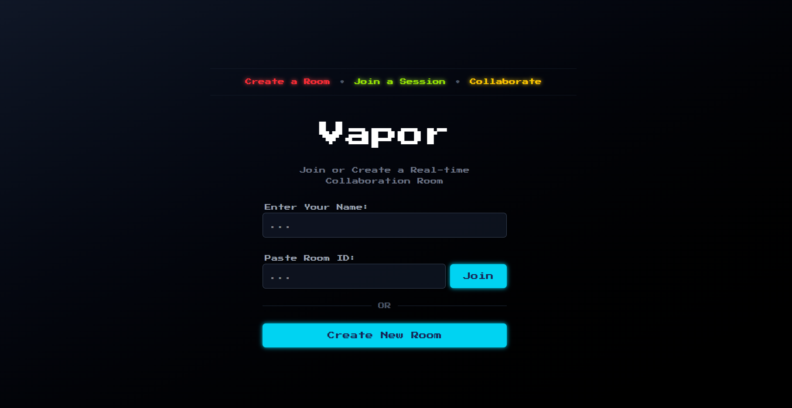
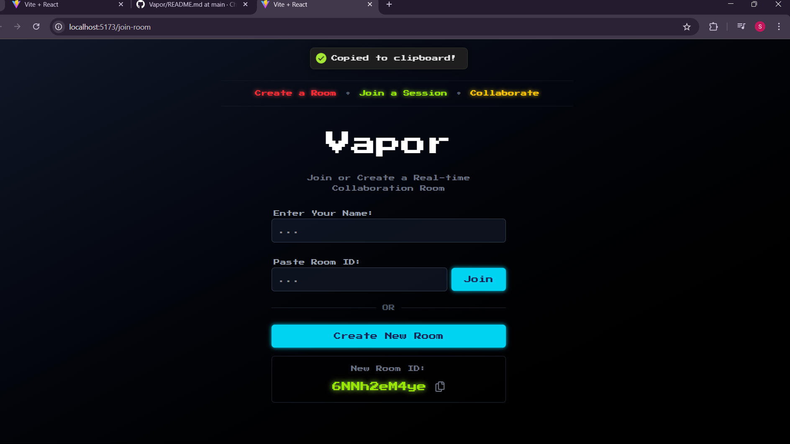

# 🌀 Vapor — Real-time Chat App

**Vapor** is a lightweight real-time chat app built using **React (Vite)** on the frontend and a custom **WebSocket server** using Node.js (`ws`) on the backend.

> 💬 Create or join a chat room using a unique room ID and enjoy real-time messaging — fast, private, and collaborative.

---

## 🚀 Features

- 🔗 Create and join private chat rooms
- ⚡ Real-time communication using WebSockets
- 🧠 Message history stored per room (using `localStorage`)
- 🌈 Retro UI with custom font and theming
- 📋 Clipboard support for room ID sharing
- 🔌 Custom built WebSocket server
- 🔐 Room-based isolation — messages stay in their room
- 🌐 Fully responsive and minimal

---

## 📂 Project Structure

```bash
Vapor/
├── backend/               # WebSocket server
│   └── server.js
├── public/                # Static assets
├── src/                   # Frontend React components
│   ├── components/
│   │   ├── ChatInterface.jsx
│   │   └── JoinRoom.jsx
│   ├── contexts/
│   │   └── IdContext.jsx
│   └── App.jsx
├── .gitignore
├── README.md
├── package.json
└── vite.config.js


Screenshots
 
 
 